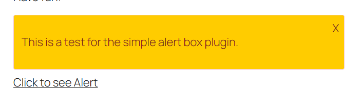

=== Simple Alert Box ===

**Contributors:** jvkrakowski  
**Tags:** alert, notification, custom post type, shortcode  
**Requires at least:** 5.0  
**Tested up to:** 6.7.2  
**Stable tag:** 1.0  
**Requires PHP:** 8.0  
**License:** GPLv2 or later  
**License URI:** https://www.gnu.org/licenses/gpl-2.0.html  

Simple Alert Box is a lightweight and easy-to-use plugin that adds an alert box to any post or page.

== Description ==

Simple Alert Box is a lightweight and easy-to-use plugin that allows you to add custom alert boxes to your WordPress site. Whether you need to display important announcements, promotions, or any other type of message, this plugin makes it simple and efficient.

== Features ==

- Easy integration with WordPress
- Customizable alert box messages
- Support for custom background.
- Responsive design for mobile and desktop
- Lightweight and fast

== Installation ==

1. Download the plugin from the WordPress library.
2. Activate the plugin.

== Manual Installation ==

1. Upload the `nrm-alert-box` folder to the `/wp-content/plugins/` directory.
2. Activate the plugin through the 'Plugins' menu in WordPress.

== Using the WordPress Admin Panel ==

1. Navigate to `Plugins > Add New`.
2. Click on `Upload Plugin` and choose the zip file of the plugin.
3. Click `Install Now` and activate the plugin.

== Usage ==

1. After activating the plugin, go to the `Alert` custom post type and create a post. Copy the alert id seen on the dashboard.
2. Customize the alert message, type, and display settings.
3. Use the shortcode `[alert_box]` to display the alert box on your posts or pages.

== Shortcode Example ==

```php
[alert_box bg_color="#ffcc00" ids="1,2,3" link_text="Click to see Alert"]
```

== Shortcode Attributes ==

- `bg_color`: The background color of the alert box. Default is `#f8d7da`.
- `ids`: All the alert ID to display the content.
- `link_text`: The text for the link that triggers the alert box. Default is `Show Alert`.

== Frequently Asked Questions ==

== How can I customize the alert box? ==

Create a post in the Alert custom post type and add the shortcode to any post or page. Change the background with `bg_color`. 

== Can I use multiple alert boxes on a single page? ==

Yes, you can use multiple alert boxes on a single page by using the `[alert_box]` shortcode multiple times with different messages and types.

== Screenshots ==

1. **Alert Box Example:**

   

== Changelog ==

== 1.0.0 ==

- Initial release

== Contributing ==x

1. Fork the repository.
2. Create your feature branch (`git checkout -b feature/your-feature`).
3. Commit your changes (`git commit -m 'Add some feature'`).
4. Push to the branch (`git push origin feature/your-feature`).
5. Open a pull request.

== License ==

This project is licensed under the GPLv2 or later License - see the [LICENSE](LICENSE) file for details.

== Credits ==

- Developed by [jvkrakowski](https://github.com/jvkrakowski)

== Contact ==

For support or inquiries, please open an issue on the [GitHub repository](https://github.com/jvkrakowski/Simple-Alert-Box-for-WordPress/issues).